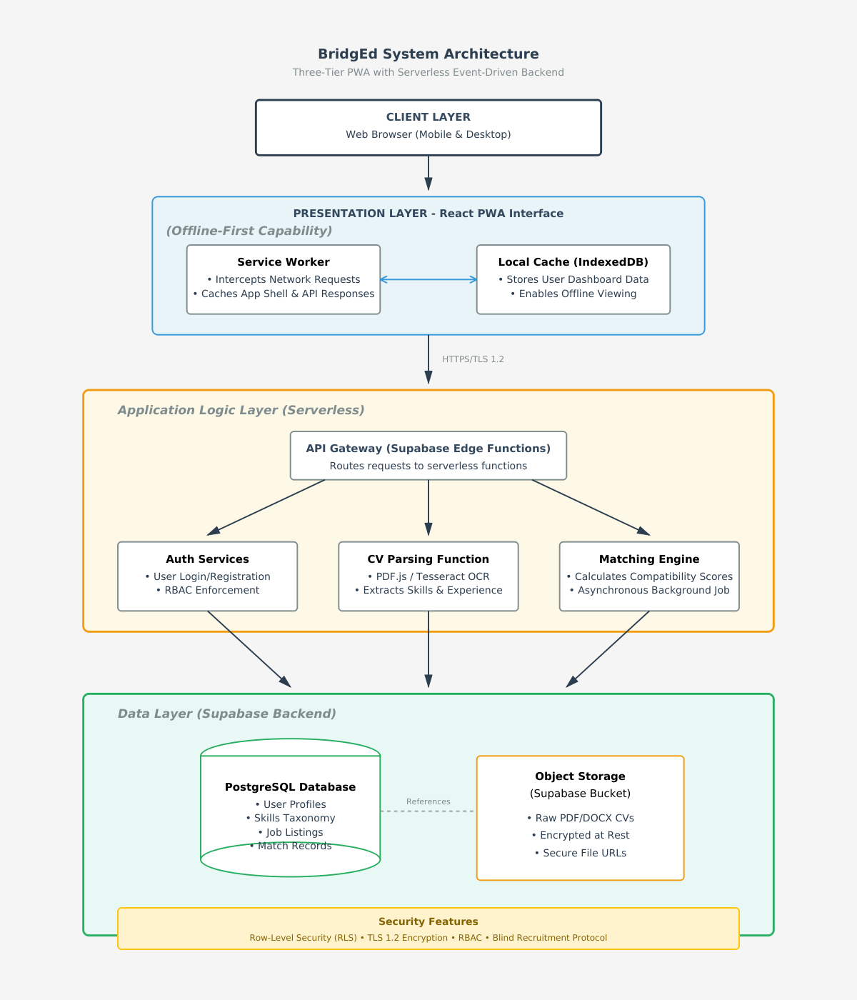
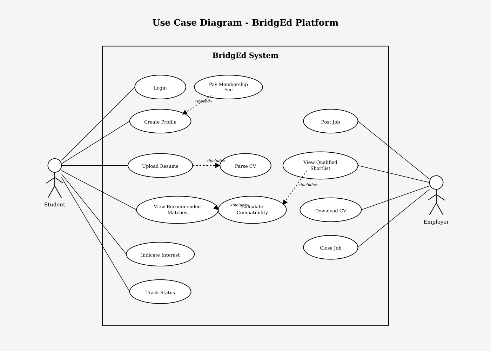
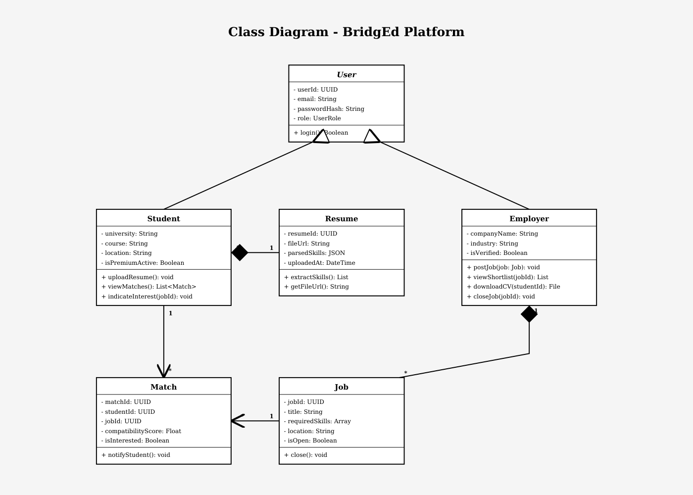
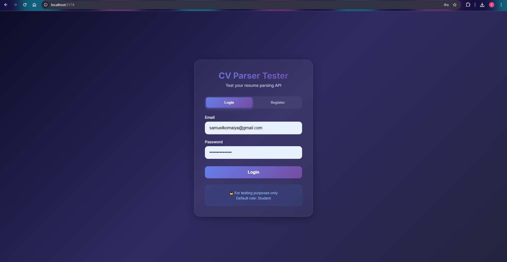
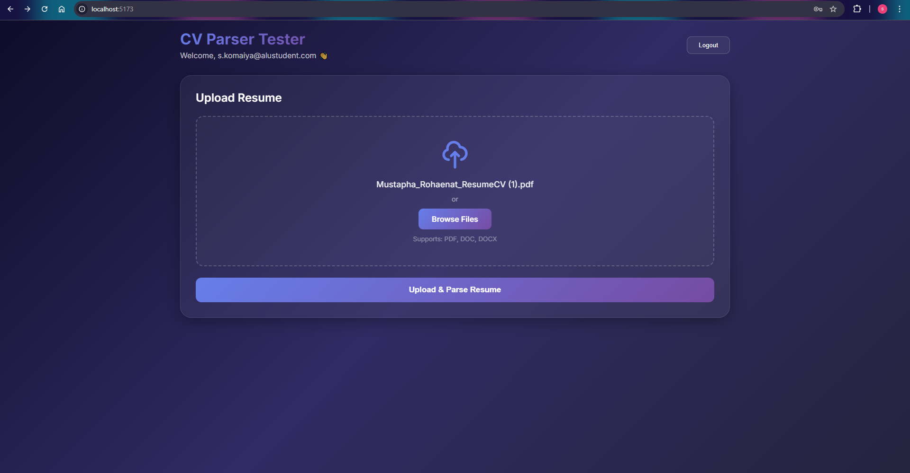
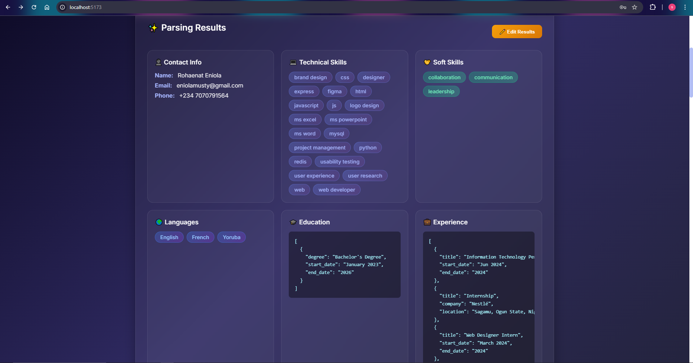
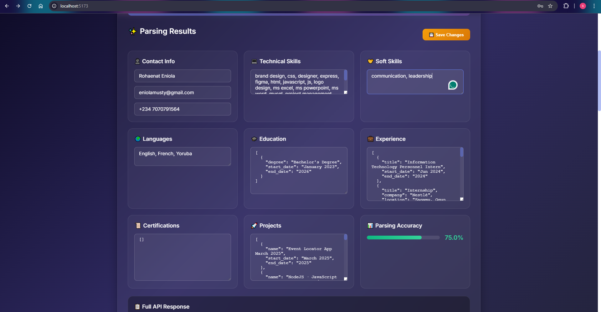

# BridgEd

**Competency-Based Industrial Placement & Recruitment Filtration System**
---

## Project Description

BridgEd is a **web-based industrial placement platform** designed to bridge the gap between Nigerian university graduates and employers through **competency-based matching**. The system addresses the critical unemployment crisis among Nigerian youth by providing intelligent job-student matching based on verified skills rather than manual CV screening.

### The Solution

BridgEd solves this dual-sided problem through:

1. **Smart CV Parsing** - Automated extraction of skills from uploaded resumes using PDF.js
2. **Competency-Based Matching** - Algorithmic matching with **>80% compatibility threshold** between student skills and job requirements
3. **Offline-First PWA** - Progressive Web App architecture ensuring access in low-bandwidth environments across Nigeria
4. **Pre-Qualified Shortlists** - Employers receive filtered candidates who have indicated interest, eliminating manual screening

### Key Features

**For Students:**

- Automated CV parsing with skill extraction
- Personalized job recommendations (>80% match)
- One-click interest indication
- Application status tracking
- Offline dashboard access

**For Employers:**

- Job posting with skill requirements
- Pre-filtered qualified shortlist
- One-click CV downloads
- Hire confirmation workflow
- Success-based pricing

**For Admins:**

- User management dashboard
- Company verification workflow
- Platform analytics
- Content moderation tools

### System Architecture

**Current Implementation:**

- **RESTful API**: Django REST Framework for scalable backend services
- **PostgreSQL**: Robust relational database with Django ORM
- **JWT Authentication**: Secure token-based authentication
- **Modular Parsing**: Separate service layer for CV parsing logic

**Planned Enhancements:**

- **PWA**: Offline viewing of dashboard and cached recommendations
- **Auto-scaling**: Handle peak traffic during SIWES mobilization periods
- **Row-Level Security**: Enhanced data access controls
- **Cloud Storage**: Optimized resume file storage

### Tech Stack

**Frontend:**

- React 19.2+ with Vite (Fast development and build tool)
- Vanilla CSS (Custom styling with modern features)
- Axios (HTTP client for API communication)
- Component-based architecture

**Backend:**

- Django 4.2.9 (Python web framework)
- Django REST Framework 3.14 (RESTful API)
- PostgreSQL (Relational database - local and Render cloud)
- JWT Authentication (djangorestframework-simplejwt)
- CORS Headers (django-cors-headers)

**CV Parsing Engine:**

- **pdfplumber** - PDF text extraction
- **python-docx** - DOCX file parsing
- **spaCy** - NLP for entity recognition
- **Custom NLP Parser** - Skill extraction, education parsing, experience analysis

**External Services:**

- Render (PostgreSQL database hosting)
- Vercel (Frontend deployment)
- Render (Backend deployment)

---

## GitHub Repository

**Repository URL:** [https://github.com/Skomaiya/BridgEd.git](https://github.com/Skomaiya/BridgEd.git)

### Repository Structure

```
BridgEd/
├── frontend/                  # React + Vite frontend
│   ├── src/
│   │   ├── components/       # React components
│   │   │   ├── Login.jsx    # Authentication
│   │   │   ├── Register.jsx
│   │   │   └── ResumeUploader.jsx  # CV upload & parsing UI
│   │   ├── App.jsx          # Main app component
│   │   ├── App.css          # Global styles
│   │   └── main.jsx         # Entry point
│   ├── index.html
│   ├── vite.config.js       # Vite configuration
│   └── package.json
│
├── api/                       # Django REST API
│   ├── views.py             # API endpoints
│   ├── serializers.py       # Data serialization
│   ├── models.py            # Database models
│   ├── urls.py              # URL routing
│   └── authentication.py    # JWT auth logic
│
├── services/                  # CV Parsing Engine
│   ├── nlp_parser.py        # Main NLP resume parser
│   ├── text_extractor.py    # PDF/DOCX extraction
│   ├── resume_pipeline.py   # Parsing orchestration
│   ├── skill_keywords.py    # 250+ skill database
│   └── matching_engine.py   # Job-resume matching
│
├── config/                    # Django project configuration
│   ├── settings.py          # Django settings
│   ├── urls.py              # Root URL configuration
│   ├── wsgi.py              # WSGI application
│   └── media/               # Uploaded resume files
│       └── resumes/
│
├── docs/                      # Documentation & diagrams
│   ├── SCREENSHOT_GUIDE.md
│   ├── screenshots/         # App interface screenshots
│   └── diagrams/
│       ├── system_architecture.png
│       ├── use_case_diagram_final.png
│       └── class_diagram_final.png
│
├── manage.py                  # Django management script
├── requirements.txt           # Python dependencies
├── .env                       # Environment variables (not uploaded)
├── .env.example              # Environment template
├── .gitignore
└── README.md
```

### Branch Strategy

- **`main`** - Production-ready code
- **`features`** - Individual feature branches

---

## Environment Setup

### Prerequisites

Ensure the following software is installed:

- **Python 3.10+** - [Download](https://www.python.org/downloads/)
- **Node.js 18+** - [Download](https://nodejs.org/)
- **PostgreSQL 14+** - [Download](https://www.postgresql.org/download/)
- **Git** - [Download](https://git-scm.com/)

### 1. Clone Repository

```bash
git clone https://github.com/Skomaiya/BridgEd.git
cd BridgEd
```

### 2. Backend Setup (Django)

**Create Virtual Environment:**

```bash
# Create virtual environment
python -m venv venv

# Activate virtual environment
# Windows:
venv\Scripts\activate
# macOS/Linux:
source venv/bin/activate
```

**Install Python Dependencies:**

```bash
pip install -r requirements.txt
```

**Download spaCy Language Model:**

```bash
python -m spacy download en_core_web_sm
```

### 3. Database Configuration

**Option A: Local PostgreSQL**

```bash
# Create database
psql -U postgres
CREATE DATABASE bridged_db;
CREATE USER bridged_user WITH PASSWORD 'your_password';
GRANT ALL PRIVILEGES ON DATABASE bridged_db TO bridged_user;
\q
```

### 4. Environment Configuration

**Copy the example environment file:**

```bash
# Windows
copy .env.example .env

# macOS/Linux
cp .env.example .env
```

**Edit `.env` and update the following values:**

- `SECRET_KEY` - Generate a new Django secret key
- `DB_PASSWORD` - Your PostgreSQL password
- Update other values as needed for your local setup

> See [`.env.example`](.env.example) for all available configuration options.

### 5. Run Database Migrations

```bash
# Apply migrations
python manage.py migrate

# Create superuser (admin)
python manage.py createsuperuser
```

### 6. Frontend Setup (React + Vite)

```bash
cd frontend
npm install
```

### 7. Start Development Servers

**Terminal 1 - Django Backend:**

```bash
# From project root
python manage.py runserver
```

Backend runs at: **http://127.0.0.1:8000**

**Terminal 2 - React Frontend:**

```bash
# From frontend directory
cd frontend
npm run dev
```

Frontend runs at: **http://localhost:5173**

### 8. Access Admin Panel

Navigate to **http://127.0.0.1:8000/admin** to:

- Manage users and resumes
- View uploaded CVs
- Monitor parsing results
- Test API endpoints

---

## Designs & Mockups

### System Architecture

**Three-Tier Web Application Architecture:**



The architecture follows a **RESTful API model** with:

- **Presentation Layer**: React SPA with Vite for fast development and optimized builds
- **Application Logic**: Django REST Framework API with JWT authentication
- **Data Layer**: PostgreSQL database with Django ORM
- **Parsing Engine**: Custom NLP service using spaCy, pdfplumber, and python-docx

**Key Components:**

- **Frontend (React + Vite)**: User interface for CV upload, job browsing, and profile management
- **Backend (Django)**: RESTful API endpoints for authentication, CV parsing, and job matching
- **CV Parser Service**: Modular parsing pipeline extracting skills, education, and experience
- **Database (PostgreSQL)**: Stores user data, parsed resumes, jobs, and matches

---

### UML Diagrams

#### Use Case Diagram



**Key Use Cases:**

- **Students**: Login, Create Profile, Upload Resume, View Matches, Indicate Interest, Track Status
- **Employers**: Post Job, View Shortlist, Download CV, Close Job
- **System**: Parse CV (automated), Calculate Match (algorithmic)

---

#### Class Diagram



**Core Classes:**

- **User** (abstract) → Student, Employer
- **Student** ◆─ Resume (1:1 composition)
- **Employer** ◆─ Job (1:\* composition)
- **Match** - Links Student and Job with compatibility score
- **Resume** - Contains parsed data (skills, education, experience)
- **Job** - Contains requirements and skill criteria

---

### Figma Mockups


---

### App Interface Screenshots

**CV Parser Component Screenshots:**


_User authentication page with clean, modern design_


_Drag-and-drop resume upload with file type validation_


_Comprehensive CV parsing results showing extracted skills, education, and experience_


_Editable fields allowing users to refine parsed data before submission_