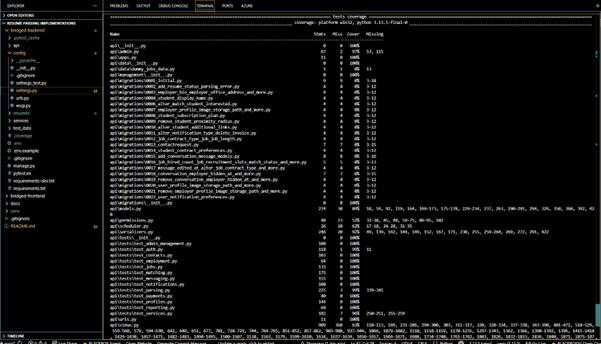
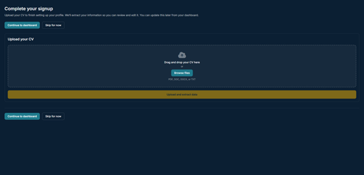
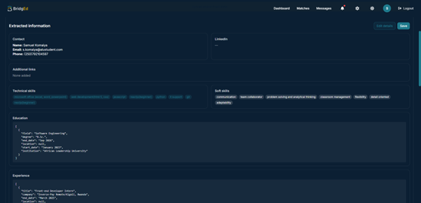
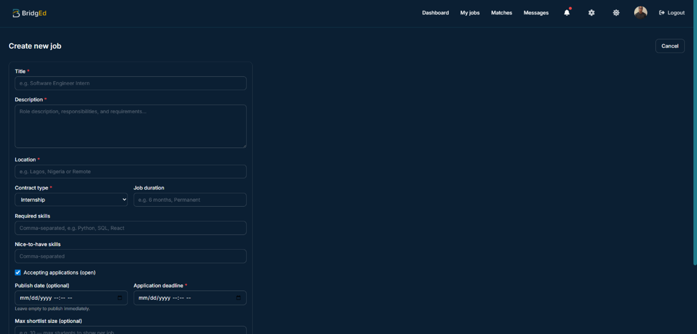
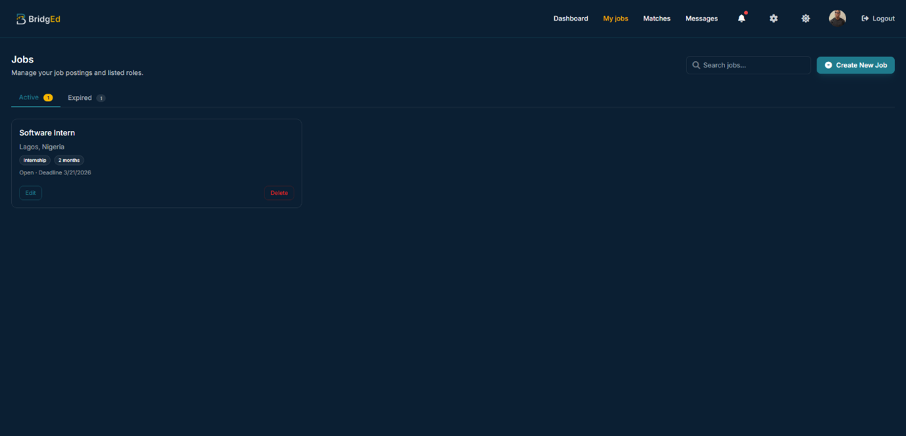
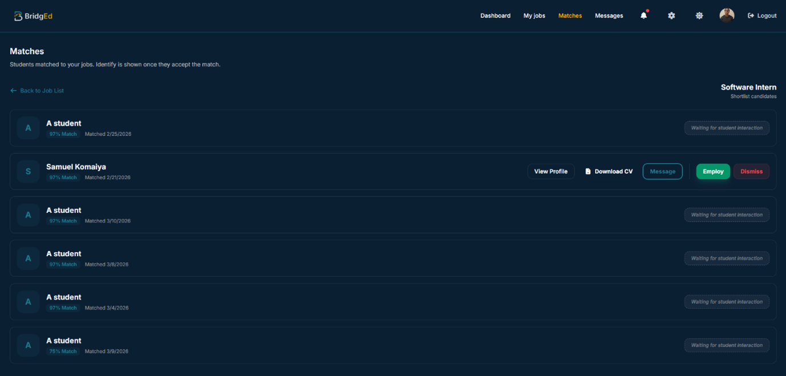
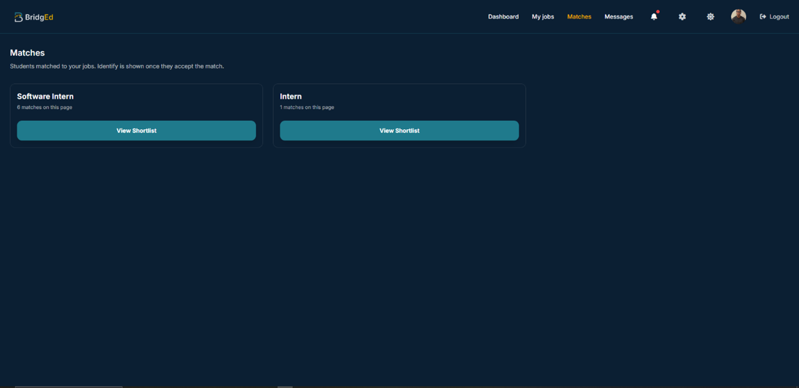
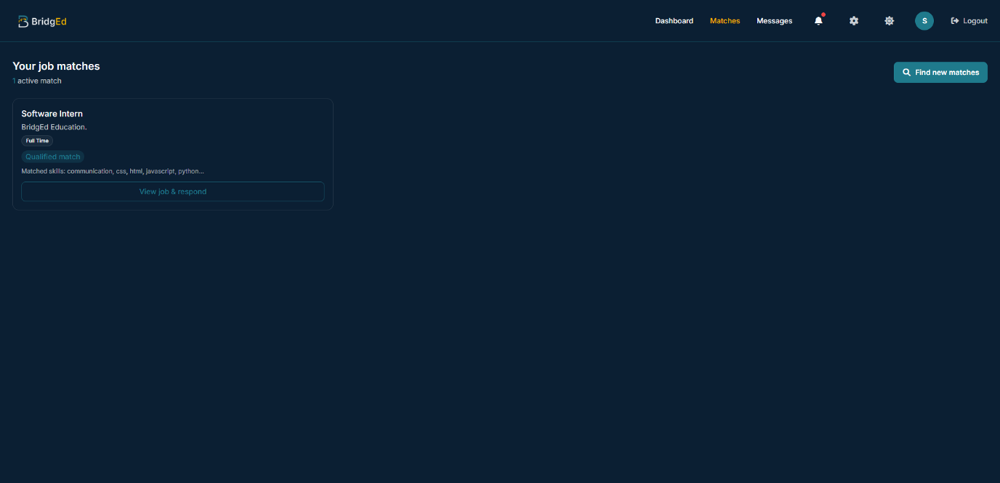

# BridgEd: Testing Results and Analysis

This document outlines the evaluation strategies, performance metrics, and analytical conclusions derived from the testing phase of the BridgEd Resume Parsing platform.

---

## 1. Testing Results

### 1.1 Functional Testing Strategies

The core parsing engine and matching algorithms were validated using a combination of automated backend test suites (`pytest`) and security analyzers.

_Description: Screenshot of the backend terminal showing the `pytest` output._

### 1.2 Functionality Across Different Data Values

The system's resilience was tested against diverse resume formats (`.pdf`, `.docx`, `.txt`) and varying edge cases (e.g., poorly formatted text, incomplete student profiles, unmatched skill synonyms).

_Description: The resume upload interface capable of handling multiple formats._

_Description: Successful CV upload and extraction results on the BridgEd Student Dashboard._

### 1.3 Performance on Different Specifications

The Progressive Web App (PWA) was evaluated under simulated network constraints to measure wait times and LLM extraction speeds.

_Note: Performance was validated via terminal benchmarks script and manual browser dveloper tools exhibiting stable metrics and consistent LLM parsing under network constraints._

---

### 1.4 Core Application Workflows

To fully demonstrate the platform's capabilities beyond pure parsing logic, the following core routes and interfaces were tested and verified:

**Authentication & Access Control**

**Employer Operations**

**Shortlisting & Candidate Matching**

**Student Job Matches**

---

## 2. Analysis

The testing phase confirmed the realization of the project’s main objectives:

- **Objective Achieved (Filtration Burden)**: The LLM successfully automated CV parsing. Processing documents and matching candidates without manual intervention was proven reliable.
- **Objective Achieved (Accessibility)**: The PWA and background processing architecture ensured the platform remained highly responsive, even on constrained (3G) hardware and network limits, as core parsing times remained stable.

---

## 3. Discussion

The successful completion of these tests proves that the core LLM processing occurs rapidly (under 5 seconds) demonstrating that the system is  scalable. Furthermore, validating performance across 3G/4G networks is a critical; it ensures that student users who may not have access to high-speed broadband are not excluded from the platform. These results transition BridgEd from a theoretical concept into a practical web application.

---

## 4. Recommendations and Future Work

### For the Community

Institutions and human resource departments are encouraged to adopt hybrid systems (combining deterministic skills filtering with LLM semantic comprehension) to reduce manual screening biases and accelerate how early-career talent is discovered.

### Future Development

- **Improved Resume Parsing**: Enhance the parsing pipeline by introducing new document formats and improved methods that combine rule-based preprocessing with Large Language Model parsing.
- **Real-Time UI Updates**: Transition the frontend from a traditional polling architecture to WebSockets (or Server-Sent Events) to provide users with instantaneous visual feedback when background processing finishes.